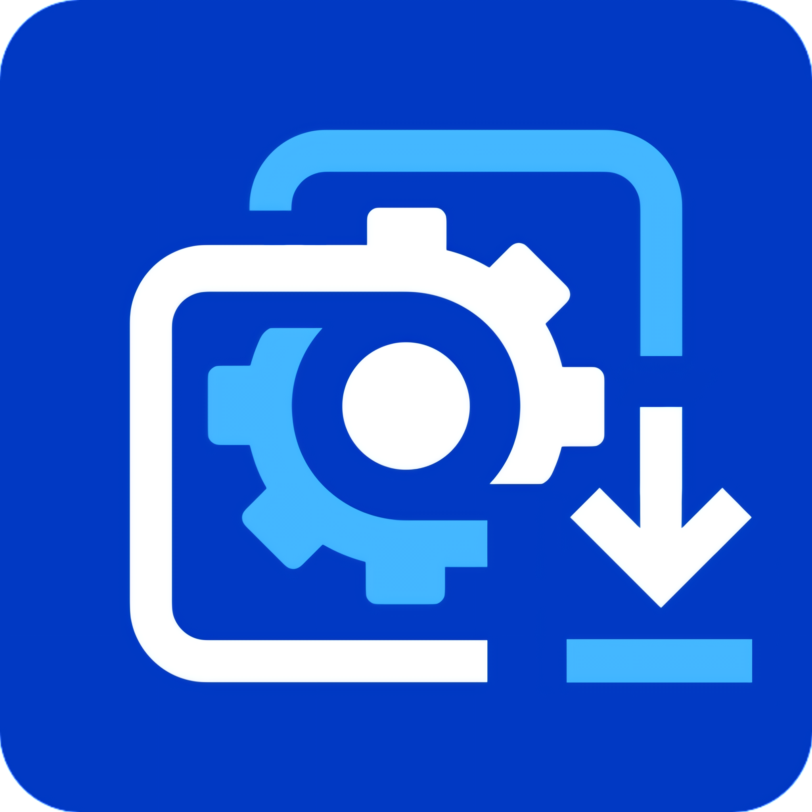

<div align="center">
  
  <h1>WallHub for Android</h1>
  <p><strong>Wallpaper Engine Workshop on Android: native discovery, streaming, resilient downloads, and local wallpaper management in one app.</strong></p>
  <p>
    <a href="README.md">简体中文</a>
    · <a href="docs/development-log.md">Development Log</a>
    · <a href="LICENSE">MIT License</a>
  </p>
</div>

## Highlights

WallHub for Android is an independent native client for Wallpaper Engine Workshop. It is built with Kotlin and Jetpack Compose, runs independently from WallHub Web, and does not embed WebView, Node.js, Python, or DepotDownloader.

- **Native Material 3 UI** with light/dark themes, system dynamic color, compact layouts, and wide-screen adaptations.
- **Complete Workshop discovery** with search, sorting, time, type, rating, category, official tag, and resolution filters, plus waterfall and paged browsing.
- **Steam account and library** with sign-in, encrypted session recovery, subscriptions, favorites, author results, and comments.
- **Online and local playback** through Media3, including JavaSteam Depot chunk streaming and bounded media caching.
- **Resilient downloads** with foreground WorkManager jobs, concurrent verified chunks, pause/resume, queue ordering, retry, and persisted state.
- **Mobile format conversion** for video/scene MPKG and website ZIP exports, including indexed PKG reads, mobile TEX conversion, targeted shader compatibility, and atomic writes.
- **Local wallpaper management** across public Downloads and SAF trees with filtering, tags, favorites, batch actions, sharing, deletion, and Wallpaper Engine import.
- **Security and diagnostics** with Android Keystore refresh-token encryption, pre-persistence log redaction, atomic exports, and path traversal protection.

## Core Features

| Area | Capabilities |
|---|---|
| Discover | Browse, search, author routes, full filters, paging/waterfall layouts, and context actions |
| Detail | Metadata, comments, subscribe/favorite actions, download choices, previews, and online playback |
| Downloads | Depot access, concurrent chunks, resume, conversion, export, pause/retry/delete actions |
| Library | Subscribed, favorited, and voted collections with search, filters, download, playback, and Steam links |
| Local | MPKG, PKG, video, and website management with tags, favorites, batch share/delete, and import |
| Settings | Theme, language, dynamic color, folders, concurrency, proxy, Steam session, diagnostics, and experiments |

## Quick Start

### Installation Requirements

- Android 8.0 (API 26) or newer.
- Network access to Steam services for Workshop and account features.
- The official Wallpaper Engine Android client for MPKG import.

Signed Release APK artifacts are produced by GitHub Actions. Open **Actions > Android CI**, select a successful `main` run, and download its `wallhub-release-<commit-sha>` artifact. Extract and install `wallhub-release.apk`. Install only artifacts you trust; Android cannot replace an existing app with an APK signed by another certificate.

### Development Environment

Install Android Studio, JDK 17 or newer, Android SDK Platform 36, and Build Tools 35.0.0.

Windows:

```powershell
./gradlew.bat testDebugUnitTest lintDebug :app:assembleDebug
```

Linux or macOS:

```bash
chmod +x gradlew
./gradlew testDebugUnitTest lintDebug :app:assembleDebug
```

The Debug APK is generated at:

```text
app/build/outputs/apk/debug/app-debug.apk
```

### Project Structure

- `app`: the only production application module. Source lives under `app/src/main/kotlin` and retains the `core`, `data`, and `feature` package boundaries.
- `benchmark`: the separately installed Macrobenchmark test module for startup and home-screen scrolling measurements.
- `build-logic`: the small set of application and Compose Gradle convention plugins.

The project intentionally avoids a separate Gradle module for every screen or data source. Only the performance tests remain separate because they must be installed and run independently.

Dependency and plugin versions are centralized in `gradle/libs.versions.toml`. Never commit signing material, `local.properties`, APK/AAB output, build caches, or local snapshots.

## References And Acknowledgements

WallHub builds on and thanks:

- [Android Jetpack Compose](https://developer.android.com/compose) and [Material 3](https://m3.material.io/)
- [JavaSteam](https://github.com/Longi94/JavaSteam)
- [AndroidX Media3](https://developer.android.com/media/media3)
- [Room](https://developer.android.com/training/data-storage/room), [WorkManager](https://developer.android.com/topic/libraries/architecture/workmanager), and [DataStore](https://developer.android.com/topic/libraries/architecture/datastore)
- [Coil](https://coil-kt.github.io/coil/), [Multiplatform Markdown Renderer](https://github.com/mikepenz/multiplatform-markdown-renderer), and [Haze](https://github.com/chrisbanes/haze)

Steam, Wallpaper Engine, and all related names, trademarks, content, and services belong to their respective owners. This independent open-source client is not affiliated with, authorized by, or endorsed by Valve Corporation, the Wallpaper Engine team, or Workshop creators.

## Disclaimer

This software is provided “as is” under the MIT License, without warranties of any kind. Users are responsible for complying with Steam, Wallpaper Engine, creator terms, and applicable laws, and assume all risks involving accounts, networking, storage, downloads, conversion, import, and content use. Respect creators and do not use this project to bypass platform rules or distribute content without authorization.

See [`LICENSE`](LICENSE) for the project license.
