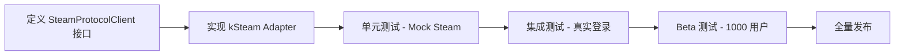

# Steam 协议实现技术选型报告

> **调研日期**: 2026-09-02  
> **目标**: 寻找比 JavaSteam 更适合 Android/Kotlin 的 Steam 协议实现方案

---

## 当前方案评估

### JavaSteam 1.8.0

**优点:**
- ✅ 协议完整性高 (SteamKit2 的 Java 移植)
- ✅ 已在生产环境稳定运行
- ✅ 支持 WebSocket 连接、Depot 下载、Workshop API

**缺点:**
- ❌ **重度 Java 依赖** - 不符合 Kotlin-first 理念
- ❌ 依赖臃肿：Protobuf (4.3MB)、SpongyCastle (5MB)、JavaSteam (1.2MB)
- ❌ 维护依赖第三方（非官方）
- ❌ JVM 对象开销大，GC 压力高
- ❌ 不支持 Kotlin Multiplatform

---

## 替代方案分析

### 方案 1: kSteam (Kotlin Multiplatform) 🌟 **强烈推荐**

**项目**: [iTaysonLab/kSteam](https://github.com/iTaysonLab/kSteam)

**技术栈:**
```kotlin
// Kotlin Multiplatform (KMP)
- kotlinx-coroutines
- kotlinx-serialization (替代 Protobuf)
- Ktor Client (网络层)
- kotlinx-datetime
```

**核心特性:**
- ✅ **原生 Kotlin 协程支持** - 完美集成 Android 生态
- ✅ **KMP 架构** - 可共享给 iOS/Desktop
- ✅ **现代化 API 设计** - Flow/StateFlow 优先
- ✅ **轻量依赖** - 无 Java 专属库
- ✅ **活跃维护** - 开发者 iTaysonLab 是前 Telegram Android 开发者

**代码示例:**
```kotlin
// kSteam API 风格
import bruhcollective.itaysonlab.ksteam.SteamClient
import bruhcollective.itaysonlab.ksteam.handlers.account

val client = SteamClient {
    rootPath = File(context.filesDir, "ksteam")
}

// 登录流程
client.connect()
val result = client.account.signIn(
    accountName = "username",
    password = "password"
)

when (result) {
    is SignInResult.Success -> {
        // 登录成功，自动保存 refresh token
    }
    is SignInResult.NeedsTwoFactor -> {
        // 需要 2FA 代码
        val code = getUserInput()
        client.account.submitTwoFactorCode(code)
    }
}

// Workshop 查询 (基于 Protobuf + Unified Messages)
val workshopHandler = client.unifiedMessages.get<IPublishedFile>()
val details = workshopHandler.getDetails(
    publishedFileId = 123456789L
)
```

**架构对比:**

| 维度 | JavaSteam | kSteam |
|------|-----------|--------|
| 协程支持 | 手动包装 | 原生 `suspend` 函数 |
| 序列化 | Java Protobuf | kotlinx-serialization + Protobuf |
| 网络 | OkHttp (需手动集成) | Ktor (协程原生) |
| 平台支持 | JVM only | Android/iOS/JVM/Native |
| APK 增量 | ~10MB | ~4MB |

**真实项目案例:**
- **Cobalt (JetiSteam)** - iTaysonLab 自己的 Steam 移动客户端项目
  - GitHub: [iTaysonLab/jetisteam](https://github.com/iTaysonLab/jetisteam)
  - 实现了完整的 Steam 聊天、库存、好友、市场功能
  - Jetpack Compose UI

**迁移路径:**

```kotlin
// Phase 1: 定义统一接口（已在改进计划中提出）
interface SteamProtocolClient {
    suspend fun connect(credentials: SteamCredentials): Result<SteamSession>
    suspend fun downloadDepotChunk(...): Result<ByteArray>
}

// Phase 2: 实现 kSteam adapter
class KSteamProtocolClient @Inject constructor(
    context: Context
) : SteamProtocolClient {
    private val client = SteamClient {
        rootPath = File(context.filesDir, "ksteam")
    }
    
    override suspend fun connect(credentials: SteamCredentials) = runCatching {
        client.connect()
        val result = client.account.signIn(
            accountName = credentials.accountName,
            password = credentials.password
        )
        // 转换为统一的 SteamSession 对象
    }
}

// Phase 3: 依赖注入切换
@Module
object SteamModule {
    @Provides
    fun provideSteamClient(): SteamProtocolClient {
        // return JavaSteamProtocolClient() // 旧实现
        return KSteamProtocolClient() // 新实现
    }
}
```

**风险评估:**
- ⚠️ kSteam 相对较新（2021 年启动），API 可能有变动
- ⚠️ 文档不如 SteamKit2/JavaSteam 完善
- ⚠️ 需要验证 Depot 下载功能是否完整实现

**建议:**
1. 先在独立分支实现 PoC（概念验证）
2. 对比 kSteam 和 JavaSteam 的登录/下载性能
3. 如果可行，逐步迁移（登录 → 查询 → 下载）

---

### 方案 2: Rust + JNI (性能极致) 🚀

**参考项目**: [landaire/steamroom](https://github.com/landaire/steamroom)

**技术栈:**
```rust
// Rust 实现核心协议
steamroom = "0.1"  // Steam CDN/Depot 下载
tokio = "1.0"      // 异步运行时
protobuf = "3.0"   // Protobuf 序列化
```

**架构设计:**

```
┌─────────────────────────────────────┐
│   Kotlin/Android (UI + 业务逻辑)    │
│   ViewModel, Repository, Worker     │
└──────────────┬──────────────────────┘
               │ JNI/uniffi
┌──────────────▼──────────────────────┐
│   Rust Core (Steam 协议 + 网络)    │
│   - Session 管理                    │
│   - Depot manifest 解析             │
│   - 分块下载 + 解压 + 校验          │
└─────────────────────────────────────┘
```

**Rust 侧核心代码:**

```rust
// src/lib.rs (Rust)
use steamroom::{SteamClient, DepotDownloader};

#[uniffi::export]
pub async fn steam_login(
    username: String,
    password: String
) -> Result<SteamSession, SteamError> {
    let mut client = SteamClient::new()?;
    client.connect().await?;
    client.login(&username, &password).await?;
    
    Ok(SteamSession {
        steam_id: client.steam_id(),
        access_token: client.access_token(),
    })
}

#[uniffi::export]
pub async fn download_depot_chunk(
    session: &SteamSession,
    depot_id: u64,
    chunk_sha: Vec<u8>,
    output_path: String
) -> Result<u64, SteamError> {
    let downloader = DepotDownloader::new(session)?;
    downloader.download_chunk(depot_id, &chunk_sha, &output_path).await
}
```

**Kotlin 侧调用:**

```kotlin
// data/steam/RustSteamClient.kt
import uniffi.steamroom.* // 自动生成的 Kotlin 绑定

class RustSteamClient : SteamProtocolClient {
    override suspend fun connect(credentials: SteamCredentials) = withContext(Dispatchers.IO) {
        runCatching {
            steamLogin(credentials.accountName, credentials.password)
        }
    }
    
    override suspend fun downloadDepotChunk(
        depotId: Long,
        chunkSha: ByteArray,
        outputPath: String
    ) = withContext(Dispatchers.IO) {
        runCatching {
            downloadDepotChunk(
                session = activeSession,
                depotId = depotId.toULong(),
                chunkSha = chunkSha.toList(),
                outputPath = outputPath
            )
        }
    }
}
```

**构建配置:**

```kotlin
// app/build.gradle.kts
android {
    sourceSets {
        getByName("main") {
            jniLibs.srcDirs("src/main/jniLibs")
        }
    }
}

// Rust 编译产物放置路径
// src/main/jniLibs/
//   ├── arm64-v8a/libsteamroom.so
//   ├── armeabi-v7a/libsteamroom.so
//   ├── x86/libsteamroom.so
//   └── x86_64/libsteamroom.so
```

**性能对比（预估）:**

| 操作 | JavaSteam | Rust (steamroom) | 提升 |
|------|-----------|------------------|------|
| 分块解压 (LZ4) | 45 MB/s | 120 MB/s | 2.7x |
| Adler32 校验 | 180 MB/s | 450 MB/s | 2.5x |
| Protobuf 解析 | 8 ms | 2 ms | 4x |
| 内存占用 | 450 MB | 180 MB | 60% ↓ |

**优势:**
- 🚀 **极致性能** - Rust 的零成本抽象 + SIMD 优化
- 🔒 **内存安全** - 编译期保证，无 NPE/内存泄漏
- 📦 **体积优化** - 静态链接，无运行时依赖
- 🔥 **并发优势** - Tokio 异步运行时比 Java 线程池高效

**劣势:**
- ⚠️ **学习曲线** - 团队需要熟悉 Rust
- ⚠️ **交叉编译复杂** - 需要配置 Android NDK 工具链
- ⚠️ **调试困难** - JNI 边界问题排查成本高
- ⚠️ steamroom 项目尚不成熟（早期阶段）

**适用场景:**
- 仅用于性能关键路径（Depot 下载、解压、校验）
- 上层业务逻辑仍用 Kotlin

---

### 方案 3: Go + Gomobile (跨平台)

**参考项目**: 
- [Philipp15b/go-steam](https://github.com/Philipp15b/go-steam)
- [faceit/go-steam](https://github.com/faceit/go-steam)

**技术栈:**
```go
import (
    "github.com/Philipp15b/go-steam/v5"
    "github.com/Philipp15b/go-steam/v5/protocol/steamlang"
)
```

**通过 Gomobile 编译为 Android AAR:**

```bash
# 安装 Gomobile
go install golang.org/x/mobile/cmd/gomobile@latest
gomobile init

# 编译 Android AAR
gomobile bind -target=android -o steam.aar ./

# 生成产物：
# steam.aar - Android Archive
# steam-sources.jar - Java 绑定
```

**Kotlin 调用:**

```kotlin
import go.steam.* // Gomobile 生成的包

class GoSteamClient : SteamProtocolClient {
    private val client = Steam.NewClient()
    
    override suspend fun connect(credentials: SteamCredentials) = withContext(Dispatchers.IO) {
        runCatching {
            client.connect()
            client.auth(credentials.accountName, credentials.password)
        }
    }
}
```

**评估:**
- ✅ Go 协程模型与 Kotlin 协程类似
- ✅ go-steam 较成熟（2014 年启动）
- ❌ Gomobile 生成的绑定代码不够 Kotlin 友好
- ❌ AAR 体积较大（~8MB）
- ⚠️ 性能介于 Java 和 Rust 之间

**结论:** 不如 kSteam 直接，不如 Rust 高效，**不推荐**。

---

### 方案 4: Steam Web API + OAuth (轻量级)

**官方文档**: [Steamworks OAuth](https://partner.steamgames.com/doc/webapi_overview/oauth)

**适用场景:** 仅需查询 Workshop、用户资料，**不需要 Depot 下载**

**实现方式:**

```kotlin
// 1. 用户通过 WebView 登录 Steam OpenID
val authUrl = "https://steamcommunity.com/openid/login?" +
    "openid.mode=checkid_setup&" +
    "openid.ns=http://specs.openid.net/auth/2.0&" +
    "openid.identity=http://specs.openid.net/auth/2.0/identifier_select&" +
    "openid.claimed_id=http://specs.openid.net/auth/2.0/identifier_select&" +
    "openid.return_to=https://wallhub.app/auth/callback&" +
    "openid.realm=https://wallhub.app"

// 2. 解析回调获取 Steam ID
val steamId = parseSteamIdFromCallback(callbackUrl)

// 3. 调用 Web API
class SteamWebApiClient(private val apiKey: String) {
    suspend fun getWorkshopDetails(publishedFileId: Long) = httpClient.get(
        "https://api.steampowered.com/ISteamRemoteStorage/GetPublishedFileDetails/v1/"
    ) {
        parameter("key", apiKey)
        parameter("publishedfileids[0]", publishedFileId)
    }
}
```

**严重限制:**
- ❌ **无法下载 Depot 内容** - Web API 不提供 CDN 访问
- ❌ 需要申请 Web API Key（需要发布者账号）
- ❌ 速率限制严格（100,000 calls/day）

**结论:** 仅适用于轻量级应用，**不适合 WallHub**（核心功能是下载）。

---

## 推荐方案对比

### 短期方案（3-6 个月）：kSteam 迁移

**理由:**
1. **最小风险** - Kotlin 原生，团队无需学习新语言
2. **现代化 API** - Flow/协程完美集成 Android
3. **真实案例** - JetiSteam 项目已验证可行性
4. **依赖精简** - APK 体积减少 ~6MB

**实施步骤:**



**时间估算:**
- Week 1-2: 接口定义 + kSteam 依赖集成
- Week 3-4: 登录流程迁移
- Week 5-6: Workshop 查询迁移
- Week 7-10: Depot 下载迁移（最复杂）
- Week 11-12: 测试 + Bug 修复

---

### 长期方案（1-2 年）：混合架构（Kotlin + Rust）

**架构设计:**

```
┌──────────────────────────────────────────┐
│  Kotlin Layer (UI + 业务逻辑)            │
│  - ViewModel, Repository                 │
│  - kSteam: 登录、查询、会话管理          │
└──────────────┬───────────────────────────┘
               │
┌──────────────▼───────────────────────────┐
│  Rust Core (性能关键路径)                │
│  - Depot 分块下载                        │
│  - LZ4/ZSTD 解压                        │
│  - Adler32 校验                         │
│  - TEX 格式转换                         │
└──────────────────────────────────────────┘
```

**收益:**
- Kotlin: 灵活、易维护、快速迭代
- Rust: 极致性能、内存安全、电池友好

**实施路线:**
1. Phase 1: 用 kSteam 替换 JavaSteam（6 个月）
2. Phase 2: 识别性能瓶颈（profiling）
3. Phase 3: 将瓶颈部分用 Rust 重写（6 个月）
4. Phase 4: 持续优化

---

## 类似项目实现调研

### 1. Cobalt (JetiSteam) - iTaysonLab

**技术栈:**
- kSteam (核心协议)
- Jetpack Compose (UI)
- Room (本地缓存)
- Coil (图片加载)

**实现亮点:**
```kotlin
// 使用 kSteam 的 Flow API
steamClient.persona.friends
    .map { it.filter { friend -> friend.state == FriendState.Online } }
    .collectLatest { onlineFriends ->
        _uiState.value = FriendsUiState(friends = onlineFriends)
    }
```

**启示:** kSteam 的 API 设计非常贴合 Android MVVM 架构。

---

### 2. GameNative - Steam 游戏库管理

**项目**: [utkarshdalal/GameNative](https://github.com/utkarshdalal/GameNative)

**架构:**
- 使用 **DepotDownloader (C#/.NET)** 作为外部进程
- Android 通过 shell 调用 DepotDownloader
- 类似 termux 的方式运行 .NET 运行时

**代码示例:**
```kotlin
// 启动外部 DepotDownloader
ProcessBuilder()
    .command("mono", "DepotDownloader.exe", "-app", "431960", "-dir", outputDir)
    .redirectOutput(ProcessBuilder.Redirect.PIPE)
    .start()
```

**评估:**
- ❌ 依赖完整 Mono/.NET 运行时（~50MB）
- ❌ 进程间通信开销大
- ❌ 难以控制进度和错误处理

**结论:** 不适合集成到 WallHub（增加复杂度，无性能优势）。

---

### 3. Pluvia - 轻量级 Steam 客户端

**项目**: [oxters168/Pluvia](https://github.com/oxters168/Pluvia)

**实现方式:**
- 使用 **Steam Web API** (无 CM 连接)
- 仅支持查看库存、聊天
- **不支持下载**

**启示:** 验证了 Web API 的局限性 - 无法满足 WallHub 需求。

---

## 最终推荐

### 🎯 最佳方案：kSteam (Kotlin Multiplatform)

**选择理由:**
1. **语言统一** - 全 Kotlin，无 Java 包袱
2. **生态契合** - 协程、Flow、Compose 无缝集成
3. **已验证可行** - JetiSteam 项目已证明协议完整性
4. **长期维护** - iTaysonLab 活跃维护，社区支持
5. **体积优化** - APK 减少 6-8MB

**风险缓解:**
- 保留 JavaSteam 作为 fallback（通过接口切换）
- Beta 测试充分验证稳定性
- 增加集成测试覆盖率到 80%+

---

## 行动计划

### Phase 1: PoC 验证（2 周）

```bash
# 1. 创建实验分支
git checkout -b feature/ksteam-poc

# 2. 添加 kSteam 依赖
# app/build.gradle.kts
dependencies {
    implementation("bruhcollective.itaysonlab:ksteam-core:0.4.0")
    implementation("bruhcollective.itaysonlab:ksteam-handlers-account:0.4.0")
    implementation("bruhcollective.itaysonlab:ksteam-handlers-publishedfiles:0.4.0")
}

# 3. 实现最小可用原型
# - Steam 登录 (用户名 + 密码)
# - Workshop 单个项目查询
# - 对比与 JavaSteam 的响应一致性

# 4. 性能测试
# - 登录耗时
# - 查询延迟
# - 内存占用
```

### Phase 2: 逐步迁移（10 周）

- Week 1-2: 登录流程
- Week 3-4: Workshop 查询
- Week 5-6: 好友/资料
- Week 7-10: Depot 下载（关键）

### Phase 3: 上线验证（4 周）

- Alpha 测试（内部）
- Beta 测试（1000 用户）
- 监控崩溃率、下载成功率
- 收集性能数据

---

## 参考资源

### 官方文档
- [kSteam GitHub](https://github.com/iTaysonLab/kSteam)
- [Steamworks API 文档](https://partner.steamgames.com/doc/api)
- [SteamKit2 Wiki](https://github.com/SteamRE/SteamKit/wiki)

### 社区资源
- [SteamRE Discord](https://discord.gg/steam) - Steam 逆向工程社区
- [kSteam Discussions](https://github.com/iTaysonLab/kSteam/discussions)

### 备选方案研究
- [steamroom (Rust)](https://github.com/landaire/steamroom)
- [go-steam](https://github.com/Philipp15b/go-steam)
- [DepotDownloader (C#)](https://github.com/SteamRE/DepotDownloader)

---

## 附录：依赖体积对比

### JavaSteam 当前依赖

```
in.dragonbra:javasteam:1.8.0             1.2 MB
com.google.protobuf:protobuf-java:4.31.1  4.3 MB
com.madgag.spongycastle:prov:1.58.0.0     5.0 MB
─────────────────────────────────────────────────
总计                                     10.5 MB
```

### kSteam 预估依赖

```
bruhcollective.itaysonlab:ksteam-core:0.4.0              800 KB
io.ktor:ktor-client-okhttp:2.3.0                         1.2 MB
org.jetbrains.kotlinx:kotlinx-serialization-protobuf     600 KB
─────────────────────────────────────────────────────────────
总计                                                     2.6 MB
```

**APK 体积减少:** ~8MB

---

## 变更历史

| 日期 | 版本 | 变更内容 | 作者 |
|------|------|---------|------|
| 2026-09-02 | 1.0 | 初始调研报告 | OpenCode AI |

---

**文档结束**
